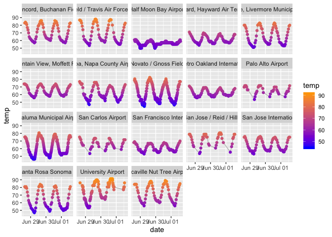

Using Python from within R
================

## Context

R & Python are two of the most popular languages used in analytics. Each
have their unique advantages, and it’s now easier than ever before to
use them both within the same environment.

In this notebook, we’ll leverage
[`reticulate`](https://rstudio.github.io/reticulate/), a package created
for using Python from within R. We’ll do this by walking through a
common data science use case so you have some intuidion for how & when
to use this within your own workflows.

From RStudio:

> > The **reticulate** package provides a comprehensive set of tools for
> > interoperability between Python and R. The package includes
> > facilities for:
> > 
> >   - Calling Python from R in a variety of ways including R Markdown,
> >     sourcing Python scripts, importing Python modules, and using
> >     Python interactively within an R session.
> > 
> >   - Translation between R and Python objects (for example, between R
> >     and Pandas data frames, or between R matrices and NumPy arrays).
> > 
> >   - Flexible binding to different versions of Python including
> >     virtual environments and Conda environments.

-----

Load the R libraries we’ll use for our analysis.

``` r
library(reticulate) ## load the reticulate library
library(tidyverse) ## loading for data wrangling and visualization
library(glue) ## loading this to help with creating URLs to hit a web API
```

Before we get into an applied example, here’s some general housekeeping
and helpful info for using `reticulate`:

Reticulate allows for the use & creation of virtual environments for
Python. Virtual environments allow you to define an isolated version of
Python that operates completely separate from the main version of Python
installed on your computer.

The packages you install in a virtual environment are isolated as well,
which is nice, because otherwise there’s a risk you’d overwrite the
versions of packages your computer depends on – which could lead to
major issues. [Here’s a
link](https://docs.python.org/3/tutorial/venv.html) to virtual
environment documentation in case you’d like to learn more.

This is the way you’d generally initiate a virtual environment for
Python in your terminal.

``` bash
workon instacart3
```

When using `reticulate`, the call is slightly different. Note that I’m
using Python3 in this notebook. YMMV if using Python2.

``` r
use_virtualenv('instacart3')
```

Reticulate also allows for the installation and import of Python
packages.

For reference, here’s how you’d generally install Python packages
*outside* of reticulate using the command line and the `pip` package
manager (`conda` is also a popular one\!).

``` bash
pip install pandas
pip install requests
```

For installation of packages in `reticulate`, you can specify the
virtual environment where you want to use and include an R list of the
Python packages you’d like to install.

``` r
virtualenv_install('instacart3',c('pandas','requests'))
```

For reference, here’s how we’d do this within a Python environment
outside of R.

``` python
import pandas
import requests
import pandas.io.json
```

Here’s the reticulate equivalent. Note that you cannot import specific
components of a Python library here.

``` r
pandas = import('pandas')
pandas_io = import('pandas.io.json')
requests = import('requests')
```

Once you’ve imported packages, you can reference the functions within
them by using the `<package_name>$<function_name>` notation (as opposed
to the `<package_name>.<function_name>` notation in Python.)

Here’s an example with
`pandas.pivot()`:

``` r
pandas$pivot
```

    ## <function pivot at 0x11ea1b488>

## Applied Example: scraping weather.gov data

``` r
stations = read_csv('/Users/matthewbrower/git/pyohio_reticulate_rpy2/r/station_identifiers.csv')
```

``` r
stations
```

    ## # A tibble: 19 x 4
    ##    station_identifier latitude longitude name                              
    ##    <chr>                 <dbl>     <dbl> <chr>                             
    ##  1 KCCR                   38.0     -122. Concord, Buchanan Field           
    ##  2 KSUU                   38.3     -122. Fairfield / Travis Air Force Base 
    ##  3 KHAF                   37.5     -122. Half Moon Bay Airport             
    ##  4 KHWD                   37.7     -122. Hayward, Hayward Air Terminal     
    ##  5 KHES                   38.7     -123. Healdsburg                        
    ##  6 KLVK                   37.7     -122. Livermore, Livermore Municipal Ai…
    ##  7 KNUQ                   37.4     -122. Mountain View, Moffett Field      
    ##  8 KAPC                   38.2     -122. Napa, Napa County Airport         
    ##  9 KDVO                   38.1     -123. Novato / Gnoss Field              
    ## 10 KOAK                   37.7     -122. Oakland, Metro Oakland Internatio…
    ## 11 KPAO                   37.5     -122. Palo Alto Airport                 
    ## 12 KO69                   38.3     -123. Petaluma Municipal Airport        
    ## 13 KSQL                   37.5     -122. San Carlos Airport                
    ## 14 KSFO                   37.6     -122. San Francisco, San Francisco Inte…
    ## 15 KRHV                   37.3     -122. San Jose / Reid / Hillv           
    ## 16 KSJC                   37.4     -122. San Jose, San Jose International …
    ## 17 KSTS                   38.5     -123. Santa Rosa, Santa Rosa Sonoma Cou…
    ## 18 KEDU                   38.5     -122. University Airport                
    ## 19 KVCB                   38.4     -122. Vacaville Nut Tree Airport

``` r
base_url = 'https://api.weather.gov/stations/'
resource = '/observations?'
```

This is a little inelegant, but I’m using for loops here to more clearly
show the discrete steps in the scraping process and show where Python is
being leveraged.

``` r
temps = data.frame(NULL)
for (i in seq_along(stations$station_identifier)){

  station = stations$station_identifier[i]
  url=glue(base_url,station,resource)
  
  page=requests$get(url)
  
  content=page$content
  content_2 = pandas_io$loads(content)
  
  df = pandas_io$json_normalize(content_2)
  
  for (j in seq_along(content_2$features)){
    
    record = tibble(date=content_2$features[[j]]$properties$timestamp[1],
                        temp=round(content_2$features[[j]]$properties$temperature[1]$value*(9/5)+32,2),
                        station_name=stations$name[i],
                        station_id = station)
    
    temps=bind_rows(record,temps)
  }
  
}
```

These API calls will occasionally return observations from further back
in time, so let’s filter them out and convert the UTC timestamps to
local time.

``` r
temps = 
  temps %>% 
  filter(date>= as.Date('2019-06-01')) %>% 
  mutate(date=lubridate::as_datetime(date,tz='America/Los_Angeles'))
```

    ## Date in ISO8601 format; converting timezone from UTC to "America/Los_Angeles".

Now that we have recent data from all weather stations, converted
temperatures from Celsius to Farenheit, and converted timezones…let’s
visualize and see what we learn\!

``` r
ggplot(data=temps,aes(x=date,y=temp)) + 
  geom_line(color='gray') + 
  scale_color_gradient(low='blue',high='orange') +
  geom_point(aes(color=temp)) + 
  facet_wrap(~station_name)
```

<!-- -->
