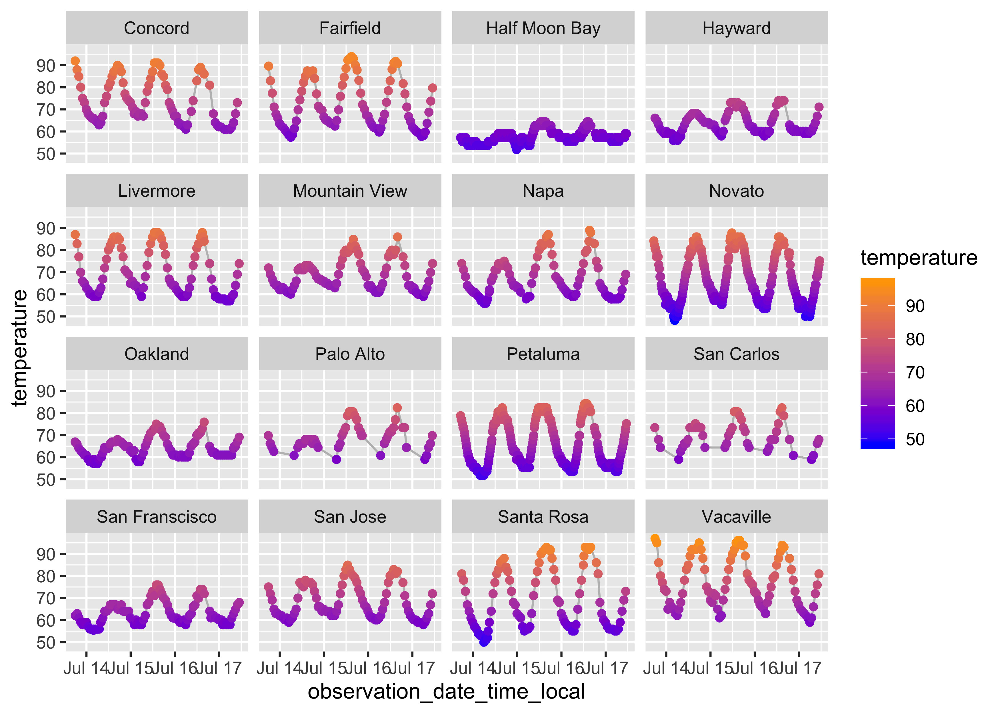

-   [Context](#context)
-   [Using reticulate](#using-reticulate)
    -   [Virtual Environments and Python /
        reticulate](#virtual-environments-and-python-reticulate)
    -   [Using pure Python within
        RStudio](#using-pure-python-within-rstudio)
    -   [Installing Python packages](#installing-python-packages)
    -   [Importing Python packages](#importing-python-packages)
-   [Applied Example: scraping weather.gov
    data](#applied-example-scraping-weather.gov-data)
    -   [Context](#context-1)
    -   [The Weather.gov API](#the-weather.gov-api)
    -   [Goals of the Exercise](#goals-of-the-exercise)
    -   [Visualizing results](#visualizing-results)

Context
-------

R & Python are two of the most popular languages used in analytics. Each
have their unique advantages, and it’s now easier than ever before to
use them both within the same environment.

In this notebook, we’ll leverage
[`reticulate`](https://rstudio.github.io/reticulate/), a package created
for using Python from within R. We’ll do this by walking through a
common data science use case to provide some intuition for how & when to
use this within your own workflows.

From RStudio:

> > The **reticulate** package provides a comprehensive set of tools for
> > interoperability between Python and R. The package includes
> > facilities for:
> >
> > -   Calling Python from R in a variety of ways including R Markdown,
> >     sourcing Python scripts, importing Python modules, and using
> >     Python interactively within an R session.
> >
> > -   Translation between R and Python objects (for example, between R
> >     and Pandas data frames, or between R matrices and NumPy arrays).
> >
> > -   Flexible binding to different versions of Python including
> >     virtual environments and Conda environments.
> >
------------------------------------------------------------------------

Using reticulate
----------------

Let’s start by loading the R libraries we’ll use for our analysis.

``` r
library(reticulate) ## load the reticulate library
library(tidyverse) ## loading for data wrangling and visualization
library(glue) ## loading this to help with creating URLs to hit a web API
library(lubridate) ## loading this for help with date operations
```

### Virtual Environments and Python / reticulate

Before we get into an applied example, here’s some general housekeeping
and helpful info for using `reticulate`:

-   Reticulate allows for the use & creation of virtual environments for
    Python.  
-   Virtual environments allow you to define an isolated version of
    Python that operates completely separate from the main version of
    Python installed on your computer.

The packages you install in a virtual environment are isolated as well,
which is nice, because otherwise there’s a risk you’d overwrite the
versions of packages your computer depends on – which could lead to
major issues. [Here’s a
link](https://docs.python.org/3/tutorial/venv.html) to virtual
environment documentation in case you’d like to learn more about how to
leverage this in Python.

This is the way you’d generally initiate a virtual environment for
Python in your terminal.

``` bash
mkvirtualenv r_py3_venv --python=python3 
```

When using `reticulate`, however, the call is slightly different. Note
that I’m using Python 3 in this notebook.

``` r
virtualenv_create("r_py3_venv", 
                  python = "/usr/local/bin/python3")
#> virtualenv: r_py3_venv
use_virtualenv("r_py3_venv")
```

### Using pure Python within RStudio

reticulate also offers some options for using *pure* Python (i.e. not
inclusive of R syntax or operators) as part of the package.

Here’s an example where we can let `knitr` run a Python chunk using
\`\`\``{python}` as the first link of the chunk.

``` python
print('hello')
#> hello
```

You can also pass a raw string of Python code to the `py_eval` function
in Reticulate.

``` r
py_eval("print('hello')")
#> NULL
```

### Installing Python packages

Reticulate also allows for the installation and import of Python
packages.

For reference, here’s how you’d generally install Python packages
*outside* of reticulate using the command line and the `pip` package
manager (`conda` is also a popular Python package and environment
manager, and reticulate has functionality here as well).

``` bash
pip install pandas
pip install requests
```

For installation of packages in `reticulate`, you can specify the
virtual environment you want to use and include an R list of the Python
packages you’d like to install to the envioronment.

``` r
py_install(c("pandas",
             "requests",
             "pandas.io"), 
           envname = "r_py3_venv")
```

Note: if you don’t specify a virtual environment, reticulate will
automatically create one called “r-reticulate” so as not to interfere
with your system’s default Python installation.

### Importing Python packages

The obvious next step here is to load the libraries we installed so we
can use them. For reference, here’s how we’d do this within a Python
environment outside of R.

``` python
import pandas
import requests
import pandas.io.json
```

Now here’s the reticulate equivalent.

``` r
pandas = import('pandas')
requests = import('requests')
pandas_io = import('pandas.io.json')
```

Once you’ve imported packages, you can reference the functions within
them by using the `<package_name>$<function_name>` notation (as opposed
to the `<package_name>.<function_name>` notation in Python.)

Here’s an example with `pandas.pivot()`:

``` r
pandas$pivot
#> <function pivot at 0x11afaf8c8>
```

Applied Example: scraping weather.gov data
------------------------------------------

### Context

I’m from Akron, Ohio where [the weather is usually cloudy and it’s cold
for at least 6 months out of the
year](https://www.usclimatedata.com/climate/akron/ohio/united-states/usoh0008).
Living in Northern California is great (for many reasons, but weather is
certainly a big one!); I’ve really been fascinated by the climates of
each San Francisco neighborhood and nearby cities.

The National Weather Service (NWS) has a [web
API](https://www.weather.gov/documentation/services-web-api) that can be
used to retrieve recently-recorded temperatures from weather stations
across the US. To explore the Bay Area’s various climates, I decided
it’d be fun to pull temperature observations for a list of nearby
weather stations.

To speed up the tutorial here for a moment - I’m going to start with a
pre-built list of area weather stations.

``` r
station_list = read_csv('data/station_identifiers.csv')
```

``` r
station_list
#> # A tibble: 17 x 5
#>    station_identifi… latitude longitude name                    short_name 
#>    <chr>                <dbl>     <dbl> <chr>                   <chr>      
#>  1 KCCR                  38.0     -122. Concord, Buchanan Field Concord    
#>  2 KSUU                  38.3     -122. Fairfield / Travis Air… Fairfield  
#>  3 KHAF                  37.5     -122. Half Moon Bay Airport   Half Moon …
#>  4 KHWD                  37.7     -122. Hayward, Hayward Air T… Hayward    
#>  5 KHES                  38.7     -123. Healdsburg              Healdsburg 
#>  6 KLVK                  37.7     -122. Livermore, Livermore M… Livermore  
#>  7 KNUQ                  37.4     -122. Mountain View, Moffett… Mountain V…
#>  8 KAPC                  38.2     -122. Napa, Napa County Airp… Napa       
#>  9 KDVO                  38.1     -123. Novato / Gnoss Field    Novato     
#> 10 KOAK                  37.7     -122. Oakland, Metro Oakland… Oakland    
#> 11 KPAO                  37.5     -122. Palo Alto Airport       Palo Alto  
#> 12 KO69                  38.3     -123. Petaluma Municipal Air… Petaluma   
#> 13 KSQL                  37.5     -122. San Carlos Airport      San Carlos 
#> 14 KSFO                  37.6     -122. San Francisco, San Fra… San Fransc…
#> 15 KSJC                  37.4     -122. San Jose, San Jose Int… San Jose   
#> 16 KSTS                  38.5     -123. Santa Rosa, Santa Rosa… Santa Rosa 
#> 17 KVCB                  38.4     -122. Vacaville Nut Tree Air… Vacaville
```

### The Weather.gov API

We can hit the web API to grab recent observations from a given station
with the following URL structure:
`https://api.weather.gov/stations/<STATION_ID>/observations`

Here’s a snippet of the JSON response we get when we hit this API with
the San Francisco Airport (station identifier: KSFO) supplied as the
weather station.

``` bash
curl -s https://api.weather.gov/stations/KSFO/observations | tail -n 75
#>                     "qualityControl": "qc:V"
#>                 },
#>                 "windGust": {
#>                     "value": null,
#>                     "unitCode": "unit:m_s-1",
#>                     "qualityControl": "qc:Z"
#>                 },
#>                 "barometricPressure": {
#>                     "value": 101390,
#>                     "unitCode": "unit:Pa",
#>                     "qualityControl": "qc:V"
#>                 },
#>                 "seaLevelPressure": {
#>                     "value": 101390,
#>                     "unitCode": "unit:Pa",
#>                     "qualityControl": "qc:V"
#>                 },
#>                 "visibility": {
#>                     "value": 16090,
#>                     "unitCode": "unit:m",
#>                     "qualityControl": "qc:C"
#>                 },
#>                 "maxTemperatureLast24Hours": {
#>                     "value": null,
#>                     "unitCode": "unit:degC",
#>                     "qualityControl": null
#>                 },
#>                 "minTemperatureLast24Hours": {
#>                     "value": null,
#>                     "unitCode": "unit:degC",
#>                     "qualityControl": null
#>                 },
#>                 "precipitationLastHour": {
#>                     "value": null,
#>                     "unitCode": "unit:m",
#>                     "qualityControl": "qc:Z"
#>                 },
#>                 "precipitationLast3Hours": {
#>                     "value": null,
#>                     "unitCode": "unit:m",
#>                     "qualityControl": "qc:Z"
#>                 },
#>                 "precipitationLast6Hours": {
#>                     "value": null,
#>                     "unitCode": "unit:m",
#>                     "qualityControl": "qc:Z"
#>                 },
#>                 "relativeHumidity": {
#>                     "value": 74.290520913219098,
#>                     "unitCode": "unit:percent",
#>                     "qualityControl": "qc:C"
#>                 },
#>                 "windChill": {
#>                     "value": null,
#>                     "unitCode": "unit:degC",
#>                     "qualityControl": "qc:V"
#>                 },
#>                 "heatIndex": {
#>                     "value": null,
#>                     "unitCode": "unit:degC",
#>                     "qualityControl": "qc:V"
#>                 },
#>                 "cloudLayers": [
#>                     {
#>                         "base": {
#>                             "value": 240,
#>                             "unitCode": "unit:m"
#>                         },
#>                         "amount": "FEW"
#>                     }
#>                 ]
#>             }
#>         }
#>     ]
#> }
```

### Goals of the Exercise

I can only retrieve data from one station identifier at a time, so I
need to build a script that can either loop over these station names in
my data and hit this API (or write a function that can be applied over
each row of the dataframe).

Since this data is returned as a nested JSON object, I **also** need to
extract each individual temperature observation and place it into a
dataframe once I get the initial response.

Web scraping & API interaction are both areas where Python arguably has
more robust libraries than R. While it’s certainly not to say there are
packages in R that *could* handle the following work elegantly, I’ve
elected to use Python here for the sake of a simple example.

I think `for` loops are typically easier to explain a process step by
step, so I’ve built one below instead of mapping a funcion over
dataframe rows.

Let’s start by verbosely breaking out the URL into components that we
can glue together as we iterate over weather stations.

``` r
base_url = 'https://api.weather.gov/stations/'
resource = '/observations?'
station = NULL
```

Ultimately, we want to store each temperature observation from each
respective station into a dataframe for us to analyze. This step creates
a ‘parking lot’ of sorts for our data to be placed in as we go through
each part of the loop.

``` r
temperature_data = data.frame(NULL)
```

Here’s where I invoke Python’s `requests` and `pandas` libraries to help
with fetching & wrangling data from the API. Have a look at the code for
an explanation of each step.

``` r
## for every row `i` in my dataframe of stations, I want to do the following
for (i in seq_along(station_list$station_identifier)){
  
  ## establish the station identifier I need to use in the API call
  station = station_list$station_identifier[i]
  ## create the URL we'll use to make the API request
  url=glue(base_url,station,resource)
  
  ## use Python's `requests` library to grab the contents of the URL I made from the web
  page=requests$get(url)
  
  ## exclude superfluous information not containing data I care about (i.e. HTPP response, etc)
  content=page$content
  
  ## use `pandas.io` from Python to extract and normalize the JSON from the API request
  content_2 = pandas_io$loads(content)
  df = pandas_io$json_normalize(content_2)
  
  ## at this point, I have a normalized JSON object stored as a list in R
  ## there is a element in this list for each observation recorded from this station
  ## for every element `j`, I want to extract the time the observation was recorded and the temperature that was recorded (in Fahrenheit)
  for (j in seq_along(content_2$features)){
    
    ## for each observation, I want a one-row dataframe with columns for date, station, and temperature
    record = tibble(date=content_2$features[[j]]$properties$timestamp[1],
                        temperature=round(content_2$features[[j]]$properties$temperature[1]$value*(9/5)+32,2),
                        station_name=station_list$short_name[i],
                        station_id = station)
    
    ## once I have that, I can append this newly-created row to a dataframe containing the final results
    temperature_data=bind_rows(record,temperature_data)
  }
  
}
```

These API calls will occasionally return observations from further back
in time, so let’s filter them out and convert the UTC timestamps to
local time.

``` r
temperature_data = 
  temperature_data %>% 
  filter(as.Date(date)>=as.Date(today()-days(3))) %>% 
  mutate(observation_date_time_local=as_datetime(date,tz='America/Los_Angeles'))
```

### Visualizing results

Now that we have recent data from all weather stations, converted
temperatures from Celsius to Farenheit, and converted timezones…let’s
visualize and see what we learn! Here’s a plot created with ggplot2 that
shows the fluctuation of temperatures at each of these stations’
observations from the past few days.

``` r
ggplot(data=temperature_data,
       aes(x=observation_date_time_local,
           y=temperature)) + 
  geom_line(color='gray') + 
  scale_color_gradient(low='blue',
                       high='orange') +
  geom_point(aes(color=temperature)) + 
  facet_wrap(~station_name)
```


